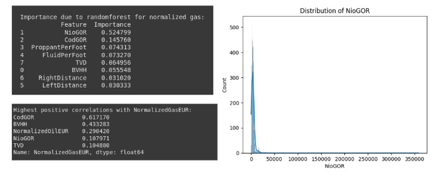
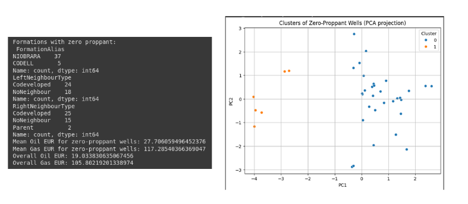
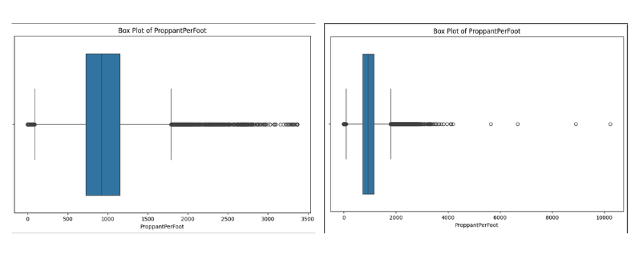
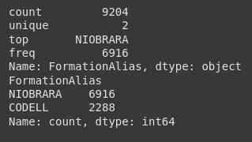
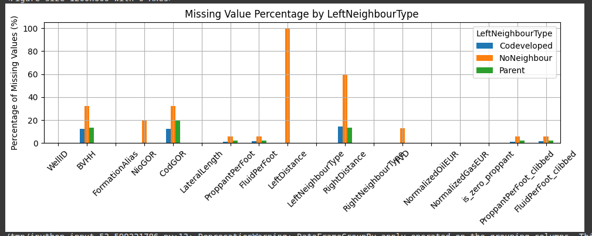
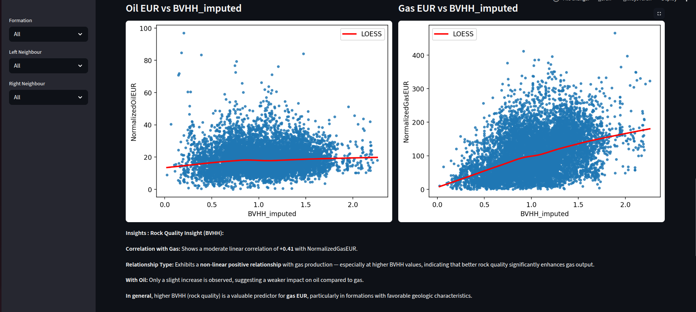

# Oil & Gas EUR Analysis & Visualization

This project provides a detailed end-to-end analysis of factors affecting **Normalized Oil and Gas EUR** (Estimated Ultimate Recovery) using engineering and geological features. The analysis includes **data preprocessing**, **feature engineering**, and **interactive visualization** via a **Streamlit web application**.

---

## Project Structure

- **Data Understanding**
- **Data Cleaning**
  - Handling zeros
  - Outliers in numerical features
  - Bad values in categorical features
- **Missing Data Imputation**
- **Exploratory Data Analysis (EDA)**
  - Individual feature analysis
  - Categorical feature distributions
  - Interactions between features
- **Feature Engineering**
  - Creating binned versions of key features
  - Imputation columns
- **Visualization**
  - Heatmap correlation matrix
  - LOESS smoothing plots
  - Interactive feature interaction analysis
  - Streamlit dashboard with filters, insights, and download options

---

## 1. Data Understanding

Initial exploration and knowing the features such as:

- **Rock quality**: `BVHH`
- **Well depth**: `TVD`
- **Gas-oil ratios**: `CodGOR`, `NioGOR`
- **Fracture stimulation inputs**: `FluidPerFoot`, `ProppantPerFoot`
- **Well spacing**: `Left/RightNeighbourType`, `Left/RightDistance`

Categorical features like `FormationAlias`, `NeighbourTypes`.

###### started by exploring the dataset to get an overall understanding of its structure and quality.

- i used `df.describe()`, `df.info()`, and `.shape` to check the basic stats, data types, and dataset size.
- I found that several columns had **missing values**, especially in key numerical features like `BVHH`, `GOR`, `TVD`, and `FluidPerFoot`, so I calculated the percentage of missing data to assess its impact.
- Then, i visualized the **distributions** of numerical features using histograms to detect **outliers** and skewed data.
- I also plotted **boxplots** for the main categorical variables (`FormationAlias`, `LeftNeighbourType`, and `RightNeighbourType`) to see how they affect both oil and gas EUR.
- To understand which features are most useful, I built **Random Forest models** for both `NormalizedOilEUR` and `NormalizedGasEUR`, and extracted **feature importance scores**.


### Outcome:

I found that:

- Some features had strong influence, like `BVHH`, `TVD`, and `ProppantPerFoot`.
- There’s a lot of missing and noisy data that I need to clean and impute properly.



---

## 2. Dealing with Zeros

I explored the features `ProppantPerFoot` and `FluidPerFoot`, where I found several wells with **zero values**, which raised concern.

#### Initial Investigation

- Plotted **histograms and boxplots** to inspect distributions and detect suspicious values.
- Found a noticeable number of **wells with Proppant = 0**, which seemed unrealistic at first.

#### Domain Research

- While analyzing, I found **Proppant = 0** can **technically occur** in certain completion strategies — so I couldn't discard zeros immediately without further analysis.

#### Clustering & PCA for Validation

To assess whether the zero entries were **outliers or valid patterns**, I:

- Applied **KMeans clustering** on zero-proppant wells using features like `TVD`, EURs, GORs, etc.
- Used **PCA for dimensionality reduction** to visualize clusters.
- Identified **minority clusters as suspicious** and flagged them for further review.

#### Result

- Replaced only the **suspicious zero values** in `ProppantPerFoot` with `NaN` to be handled later.
- Left **valid zeros** untouched based on domain reasoning and cluster behavior.

> This approach ensured that **true engineering cases weren't discarded**, while **data issues were still addressed**.



---

## 3. Outliers & Bad Data

### Numerical Features

#### Outlier Clipping for Skewed Distributions

I observed extreme values in `ProppantPerFoot` and `FluidPerFoot`, which could bias the analysis. To address this:

- I **clipped** the values to the [0.04%, 99.8%] quantile range using `pandas.clip()`.
- This kept the data range realistic without removing too many samples.
- Boxplots before and after clipping showed much cleaner distributions.



#### Handling Invalid BVHH Values

- The `BVHH` feature had **two negative values**, which are **physically invalid**.
- Upon inspection, both rows also had **missing `LeftDistance`**, which made them unreliable.
- I **dropped** those rows instead of imputing, to avoid injecting noise.

#### EUR Features Inspection

- Boxplots for `NormalizedOilEUR` and `NormalizedGasEUR` revealed a few extreme values.
- I manually inspected these points (Oil EUR > 95) but left them untouched for now as they could represent **valid high-performing wells**.

#### Duplicate Detection

- I checked for **duplicate wells** using `WellID`.

### Categorical Features

I explored the three key categorical features in the dataset:

#### `FormationAlias`

- The two main categories are:
  - `Niobrara`: **dominates the dataset** with more than **double** the number of wells compared to `Codell`.
- This imbalance is important as it may **bias the model** toward Niobrara-related trends.



#### `LeftNeighbourType`

- Distribution:
  - `Codeveloped`: 6046 wells
  - `NoNeighbour`: 2448 wells
  - `Parent`: 712 wells
- There is a clear skew toward the `Codeveloped` category.

#### `RightNeighbourType`

- Nearly identical distribution as `LeftNeighbourType`, indicating symmetrical development patterns.

> I noted the **imbalance** in categories as it can influence statistical comparisons and model predictions. I’ll keep this in mind during modeling and visualization to avoid misleading interpretations.

---

## 4. Missing Data

### Missing Data Analysis

I began by assessing the extent of missing data in the dataset. I calculated both the **absolute number** and the **percentage of missing values** for each column.

#### Key Findings

* Several important numerical features had  **significant missing values** , including:

  * `ProppantPerFoot`
  * `FluidPerFoot`
  * `TVD`
  * `NioGOR`
  * `BVHH`
  * `RightDistance` and `LeftDistance`
* I discovered that many of these features are  **highly correlated** , for example:

  * missing data in `ProppantPerFoot` and `FluidPerFoot` had a correlation of around  **0.9** .
  * `TVD` and `NioGOR` had a correlation of around  **0.8** .
  * also the missing data in right and left disance is related to the neighbour types which when there is no neighbour there is missing data in its distance so this not consider a missing data as it is not defined

  This suggests that the missingness is  **not completely random** , but rather  **Missing At Random (MAR)** .
* To confirm this, I also compared the missingness across categorical features:

  * Features like `FormationAlias`, `LeftNeighbourType`, and `RightNeighbourType` showed **different missing percentages** across their categories.
  * For example, the percentage of missing values in `CodGOR` varied significantly across formations — reinforcing the  **MAR assumption** .

Instead of applying generic filling methods, I knew which variables were critical to preserve and how the missingness might impact model accuracy.


### Missing Data Imputation

After thoroughly analyzing the missing data patterns, I applied **a multi-step strategy** to fill in the missing values using domain logic, tree-based models, and KNN-based imputation.

##### Logical Filling Based on Domain Knowledge

* For wells with **no neighbor** (`LeftNeighbourType` or `RightNeighbourType` = "NoNeighbour"), I filled:
  * `RightDistance` and `LeftDistance` with **`-1`** to indicate the absence of measurement rather than a numerical zero.
* This approach helps inform downstream models that the distance data is  **missing for a reason** , not just noise.



##### Random Forest Imputation (for NoNeighbour Cases)

To impute `TVD` and `NioGOR` specifically in wells with no neighbors (where linear methods might fail), I used **Random Forest Regressors** trained on:

* `FormationAlias`
* `LateralLength`
* `ProppantPerFoot`
* `FluidPerFoot`

**Model Accuracy:**

| Feature | R² Score | MAE     | RMSE    |
| ------- | --------- | ------- | ------- |
| TVD     | 0.916     | 131.00  | 187.70  |
| NioGOR  | 0.867     | 1247.87 | 4217.12 |

These high scores indicate a strong ability to predict the missing values reliably in this subset.

##### KNN Imputation for General Missing Data

For the rest of the missing values, I used a **KNN Imputer (k=5)** on a one-hot encoded dataset, including:

* `FormationAlias`, `LateralLength`
* `TVD_imputed`, `NioGOR_imputed`
* `FluidPerFoot_clibbed`, `ProppantPerFoot_clibbed`
* `CodGOR`, `BVHH`

This imputation filled in:

* `FluidPerFoot`
* `ProppantPerFoot`
* `CodGOR`
* `BVHH`

##### Why KNN?

Because many features are **non-linearly related** and  **correlated** , KNN captures local structure in the feature space better than simple statistical imputers.

##### KNN Imputation Evaluation

Each imputation method was validated by **masking known values** and evaluating predictions.

| Feature         | R² Score | MAE    | RMSE   |
| --------------- | --------- | ------ | ------ |
| FluidPerFoot    | 0.743     | 132.56 | 232.75 |
| ProppantPerFoot | 0.800     | 125.25 | 216.40 |
| BVHH            | 0.696     | 0.126  | 0.195  |
| CodGOR          | 0.925     | 376.53 | 885.21 |

These scores confirm that the imputation preserved the structure and patterns in the data with  **high fidelity** .

---

## Data Analysis

After cleaning and imputing the dataset, I performed exploratory data analysis on the following selected features:

* **Well Info** : `WellID`, `FormationAlias`, `LateralLength`
* **Neighbor Info** : `LeftNeighbourType`, `RightNeighbourType`, `RightDistance_filled`, `LeftDistance_filled`
* **Target Variables** : `NormalizedOilEUR`, `NormalizedGasEUR`
* **Core Predictors** : `BVHH_imputed`, `CodGOR_imputed`, `FluidPerFoot_imputed`, `ProppantPerFoot_imputed`, `NioGOR_imputed`, `TVD_imputed`
* **Flags** : `is_zero_proppant`, `TVD_missing_noneighbour`, `NioGOR_missing_noneighbour`

### Summary of Analysis

* **CodGOR** showed a strong **positive linear correlation** with `NormalizedGasEUR` (≈ 0.61).
* **BVHH** had a moderate linear correlation with `NormalizedGasEUR` (~0.41), particularly strong within the **NIOBRARA** formation.
* **ProppantPerFoot** and **FluidPerFoot** had a moderate positive relationship with `NormalizedOilEUR` (≈ 0.27–0.29).
* No significant negative linear correlation appeared between features and target variables.
* Additional visual analysis was done for each feature individually, and the **interactions** between key features were visualized to understand their influence on the targets.

### Visualization App

All EDA visualizations (feature-wise and interaction-based) are available in a  **Streamlit dashboard** .

To run the app locally, simply run:

```bash
streamlit run app.py

```

## 7. Streamlit App

The full analysis is integrated into a **Streamlit App** featuring:

- **Sidebar filters** for Formation and Neighbour Types
- **LOESS plots** for each selected feature
- **Feature insight descriptions** (automated)
- **Custom interaction analysis** using dynamic feature pairs
- **Categorical distribution comparison**
- **Download options**:
- Feature summary report
- Heatmap and LOESS plots



you could see how is the visulization in streamlit with this link 

[visual streamlit ](https://drive.google.com/drive/u/2/folders/1dT29fz3nCHuft4X93r-X80MglYyC3HsR)

### 8. Feature ENgineering

Based on the analysis insights, I engineered several new features to capture domain knowledge, interactions, and non-linear effects:

##### Geological Interaction Features

**BVHH_x_NIOBRARA**:

Captures the interaction between BVHH and the NIOBRARA formation, as this relationship was found to be more impactful than in CODELL.

```python
BVHH_x_NIOBRARA = BVHH_imputed × [FormationAlias == "NIOBRARA"]
```

##### Binning Features

**BVHH_bin**:

Bins the BVHH_imputed into 3 levels: Low, Medium, High

**NioGOR_bin:**

Similar binning for NioGOR_imputed into Low, Medium, High

These binned features help identify threshold-based behavior in well performance.

##### Interaction Features

**Proppant_x_BVHH:**

Captures the interaction between rock quality and the stimulation parameter.

```python
Proppant_x_BVHH = ProppantPerFoot_imputed × BVHH_imputed
```

**Proppant_sq_x_BVHH:**

Introduces non-linearity by squaring ProppantPerFoot before multiplying with BVHH.

```python
Proppant_sq_x_BVHH = (ProppantPerFoot_imputed^2) × BVHH_imputed
```
